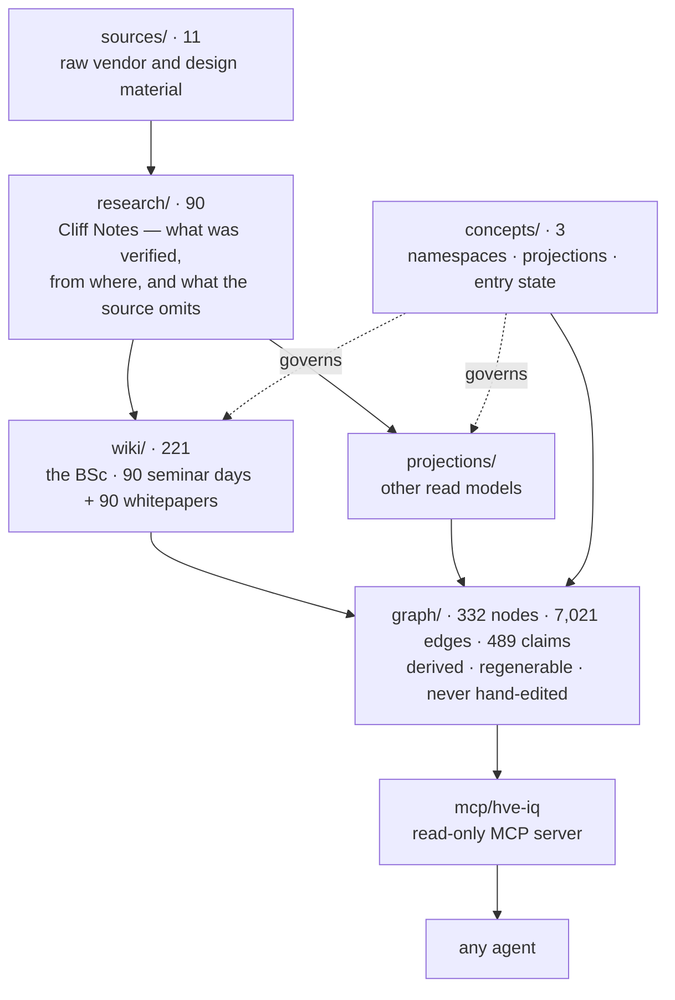

# High Velocity Engineering

> A knowledge system about forward-deployed and hypervelocity engineering — and about **how to teach them**.
>
> **Agents: read [AGENTS.md](AGENTS.md) first, then load [graph/graph.json](graph/graph.json).**

Most curricula are a syllabus: a list of topics in an order someone defended once, in a format chosen before the content existed. This is the other thing.

It is a body of **claims**, each carrying the evidence that warrants it, the namespace that governs what it may be compared against, and the rate at which it goes stale. Teaching formats are **projected** from that body rather than being the body itself. The three-year BSc in [wiki/](wiki/Home.md) is the first projection and the only finished one — **it is a seed, not the product.** A two-day workshop, a certification path, a thirty-day onboarding plan and an engagement playbook are equally legitimate read models over the same claims.

331 markdown files, one graph builder, one MCP server. **Every fact lives in the markdown**; the two pieces of code are derived tooling that never writes to the substrate.



## Start here

| If you want to | Go to |
|---|---|
| Read the programme | [wiki/Home.md](wiki/Home.md) |
| Check what backs a claim | [research/](research/99-source-register/source-register.md) |
| Build your own format from this | [concepts/projections.md](concepts/projections.md) |
| Query it from an agent | [mcp/hve-iq/](mcp/hve-iq/README.md) |
| Understand the rules the design set itself | [AGENTS.md](AGENTS.md) |
| See where the vendor study notes went | [sources/README.md](sources/README.md) |

## The citation chain

**sources → research → wiki.** Every external factual claim in the wiki traces to a Cliff Note; every Cliff Note records what was verified, from where, and **what the source does not say**. This is enforced, not aspirational: all 90 whitepapers close with an `## Evidence status` section sorting every claim into exactly one of four classes.

1. **Verified in this repository** — cites a `research/` note.
2. **Cited from general knowledge, not verified here** — direction and mechanism only.
3. **Design reasoning with no external warrant** — the design's own argument, marked as such.
4. **Grounded in vendor documentation, with its version and its silence recorded.**

There is no fifth class. A claim that fits none of them does not go in.

**No effect size is asserted anywhere for an unverified source** — including vendor material. A short list of widely repeated figures is [explicitly prohibited](wiki/program/09-Durable-and-Perishable-Register.md) because no published source substantiates them; they appear in this repository only on the prohibition lists themselves.

## Eight namespaces, not one

Claims may not be compared across namespaces raw. A Learn page and a learning-science finding are both "evidence" and neither licenses what the other licenses.

| Namespace | Licenses | Decays in | Pages |
|---|---|---|---|
| `platform` | Vendor docs at a stated version, plus what they do **not** report | **months** | 40 |
| `ai-systems` | Mechanism verified; magnitudes do not transfer | 1–3 years | 4 |
| `measurement` | Identity under a stated model and interval, with dependency structure | permanent | 79 |
| `pedagogy` | **Direction and mechanism only. No effect size, ever.** | decades | 39 |
| `assessment` | Ordinal judgement with narrative substantiation; no percentages | decades | 22 |
| `fde-craft` | Practice pattern, weak formal warrant | slow | 16 |
| `curriculum` | Design reasoning and accreditation mapping | years | 12 |
| `method` | Design reasoning, no external warrant | on amendment | 9 |

The number worth holding: **212 of 221 wiki pages are platform-bearing, but only 40 have `platform` as their primary namespace.** The durable/perishable split runs *inside* pages, at claim level — which is why [11-Microsoft-AI-Platform-Map.md](wiki/program/11-Microsoft-AI-Platform-Map.md) demands verification before every offering rather than once a term.

Full definitions: [concepts/namespaces.md](concepts/namespaces.md).

## Projections

A projection may select, sequence, compress and re-voice. It may **not** upgrade an evidence class, assert what the claims do not license, or quietly drop the decay clock. **Abstention is a valid output** — a projection that cannot honestly cover something says so.

- [wiki/](wiki/Home.md) — the BSc. 9 quarters, 18 modules, 90 seminar days, 90 whitepapers, 11 assessed days.
- [projections/workshop-2day/](projections/workshop-2day/README.md) — ten claims, four explicit abstentions, and a [derivation log](projections/workshop-2day/DERIVATION.md) recording every place the format broke.

### What a projection owes its audience

Dependencies are not absolute. They are relative to an **entry state**, and the wiki natively encodes only one — the BSc's, which is *knows nothing*. [concepts/entry-state.md](concepts/entry-state.md) classifies all 90 days against a fixed reference professional so other projections can compute their own:

| Value | Days | The projection must |
|---|---|---|
| `ordinary-professional-experience` | **2** | assume silently |
| `either` | **47** | **declare** as an assumption |
| `this-programme-only` | **41** | deliver, or drop what depends on it |

Two days of ninety can be assumed silently. The consequence for the workshop: its closure falls from **57 days to 23** once it declares its assumptions — and five of the fourteen it must still deliver are the measurement spine, which is the workshop's own subject. That finding came from a mechanical query, not from taste, and it overturned a hand-written estimate that had said three.

The register is `method` namespace, has no external warrant, and **has never been tested against a real audience.** Its limitations are stated on the page, including the possibility that it is circular.

## HVE IQ

A read-only MCP server over the graph, so any agent can consume this — Copilot in an IDE or CLI, a Foundry agent, Copilot Studio, Claude, Cursor. An agent has one consumer; a server has all of them.

```bash
cd mcp/hve-iq && npm install && npm run smoke
```

Registered in [.vscode/mcp.json](.vscode/mcp.json), so in Copilot agent mode you can ask:

> *"Using hve-iq, what would a two-day workshop on judge bias and criterion construction also have to cover, for an audience of experienced engineers?"*

Five tools: `hve_namespaces`, `hve_search`, `hve_get`, `hve_dependency_closure` and `hve_platform_exposure`. The last two are the ones that are not ordinary retrieval — one tells you what a format must also cover, the other tells you what a vendor change just broke. Details and known gaps: [mcp/hve-iq/README.md](mcp/hve-iq/README.md).
## It corrects itself in public

The most valuable and most fragile thing here. Superseded positions stay visible; amendments are annotated where they happened.

- **Nine instrumentation rules**, each recorded with the failure that produced it ([04-Seminar-Day-Design-Pattern.md](wiki/program/04-Seminar-Day-Design-Pattern.md)).
- **Rule 5 was found unsatisfiable at design time** and amended twice rather than quietly dropped.
- A **compliance register** recording where the design broke its own rules, with `Fixed` / `Recorded` / `Discharged` status ([05-Whitepaper-Standard.md](wiki/program/05-Whitepaper-Standard.md)).
- Specifications close with **"Nothing else is assessed."** — except S001–S040, which predate the rule and are **deliberately left unamended** so the defect that produced it stays legible ([03-Assessment-Architecture.md](wiki/program/03-Assessment-Architecture.md)).
- Every whitepaper's §8 states at least two objections at their strongest, **concedes at least one**, and names the fix it declined.
- The workshop projection has now been corrected twice by mechanical queries against its own claims, both corrections kept in view ([DERIVATION.md](projections/workshop-2day/DERIVATION.md)).

A reader who cannot see the defect cannot evaluate the correction. **When you change something here, add to the record rather than erasing what it replaced.**

## Validate

```powershell
pwsh ./scripts/build-graph.ps1        # 332 nodes, ~7,021 edges, 489 claims
cd mcp/hve-iq; npm run smoke          # 24 checks, all must pass
```

Link integrity should report exactly **3 broken links** — all placeholders inside a fenced code block in the whitepaper standard. The command is in [AGENTS.md](AGENTS.md).

## Open issues, honestly recorded

- **The platform layer is the most perishable content here.** Two of the six vendor sources were already classic or superseded when read; the [study-note package](sources/README.md) they came from reflects July 2026 and needs checking before it is quoted.
- **The entry-state register is untested** against a real audience and plausibly circular. It is a usable default, not a finding.
- **Claim extraction has only reached `platform`**, and only where the substrate had already made it a table — **489 pairs across 74 days**. S001–S015 use a prose register that predates the format and are invisible to decay queries; the other seven namespaces remain document-level.
- **Two rule elevations are unratified** at programme close ([WP-090](wiki/whitepapers/WP-090.md) §7).
- **WP-090 §8 concedes the instrumentation is probably unexecutable**, and predicts fewer than one in ten of the wiki's own §9 predictions will ever be measured.
